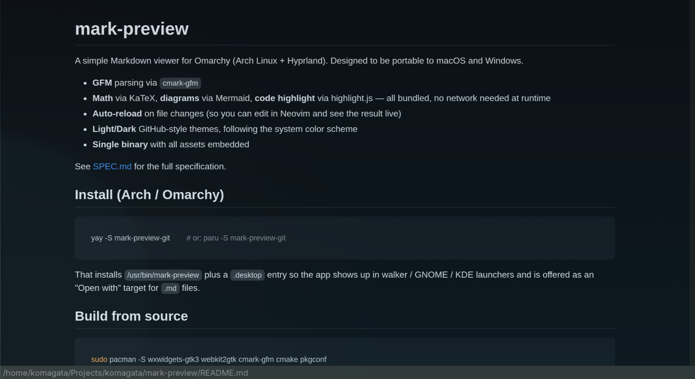

# mark-preview

A simple Markdown viewer for Omarchy (Arch Linux + Hyprland). Designed to be
portable to macOS and Windows.



- **GFM** parsing via `cmark-gfm`
- **Math** via KaTeX, **diagrams** via Mermaid, **code highlight** via highlight.js — all bundled, no network needed at runtime
- **Auto-reload** on file changes (so you can edit in Neovim and see the result live)
- **Light/Dark** GitHub-style themes, following the system color scheme
- **Single binary** with all assets embedded

See [SPEC.md](SPEC.md) for the full specification.

## Install (Arch / Omarchy)

```sh
yay -S mark-preview-git        # or: paru -S mark-preview-git
```

That installs `/usr/bin/mark-preview` plus a `.desktop` entry so the app
shows up in walker / GNOME / KDE launchers and is offered as an "Open with"
target for `.md` files.

## Build from source

```sh
sudo pacman -S wxwidgets-gtk3 webkit2gtk cmark-gfm cmake pkgconf
./scripts/fetch-assets.sh        # downloads KaTeX/Mermaid/highlight.js once
cmake -B build -DCMAKE_BUILD_TYPE=Release
cmake --build build -j
./build/mark-preview samples/demo.md
```

## Usage

```sh
mark-preview                     # empty window
mark-preview path/to/foo.md      # open a file
mark-preview --help              # show CLI help
mark-preview --version
```

Launch under native Wayland (the default on Hyprland) — **do not set
`GDK_BACKEND=x11`**: on at least some HiDPI / multi-monitor setups the
XWayland route stops delivering mouse-wheel and scrollbar input to the
embedded WebKit view, while keyboard input still works.

Inside the window:

| Action          | Shortcut         |
| --------------- | ---------------- |
| Open file       | `Ctrl+O`         |
| Reload          | `Ctrl+R`         |
| Close file      | `Ctrl+W`         |
| Quit            | `Ctrl+Q`         |
| Zoom in / out   | `Ctrl++` / `Ctrl+-` |
| Reset zoom      | `Ctrl+0`         |

Drag and drop a `.md` file onto the window to open it.

External `http(s)` links open in the OS default browser. Relative links to
other `.md` files reopen inside the viewer. Images and other relative
assets are loaded from the markdown file's directory.

## Project layout

```
src/                 C++ source
assets/              Downloaded by scripts/fetch-assets.sh and embedded at build time
cmake/               EmbedAssets.cmake + embed_asset.py
scripts/
  fetch-assets.sh    Idempotent asset downloader (curl + jsdelivr CDN)
  test-render.sh     Smoke test (renders samples/demo.md, checks key tokens)
samples/             Demo Markdown files
```

The build produces two binaries:

- `build/mark-preview` — the GUI viewer (links wxWebView / WebKit2GTK).
- `build/mp-render`    — a console-only renderer that prints the rendered
                          HTML to stdout. Used by `scripts/test-render.sh`
                          and useful for debugging.

## Tests

```sh
./scripts/test-render.sh
```

Verifies that the rendering pipeline produces the expected HTML (code blocks
with `class="language-X"`, GFM tables, task-list checkboxes, math delimiters,
embedded asset URLs, and that raw `<script>` tags are escaped).

## License

MIT. See `LICENSE` for bundled-asset attributions.
