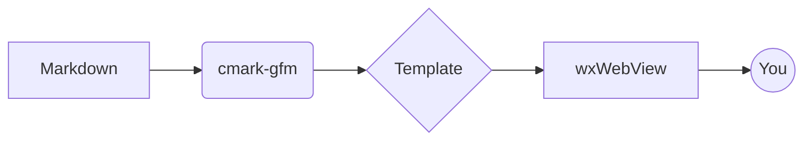

# mark-preview demo

A small file that exercises every feature.

## Inline elements

**bold**, *italic*, ~~strike~~, `code`, [link](https://example.com), and an autolink: https://github.com .

## Lists

- bullet
  - nested bullet
- another bullet

1. numbered
2. another
   1. nested

## Task list

- [x] write SPEC.md
- [x] implement viewer
- [ ] write tests

## Table

| Lang   | Year | Notes        |
| ------ | ---: | ------------ |
| Ruby   | 1995 | dynamic      |
| Go     | 2009 | static, fast |
| C++    | 1985 | systems      |

## Code (with highlight)

```ruby
def fibonacci(n)
  return n if n < 2
  fibonacci(n - 1) + fibonacci(n - 2)
end

puts fibonacci(10)
```

```go
package main

import "fmt"

func main() {
    fmt.Println("hello, mark-preview")
}
```

## Math (KaTeX)

Inline: $E = mc^2$ and a Greek letter $\alpha + \beta = \gamma$.

Display:

$$
\int_{-\infty}^{\infty} e^{-x^2}\,dx = \sqrt{\pi}
$$

## Diagram (Mermaid)



## Blockquote

> "Plain text plus a few conventions" — John Gruber, 2004.

## HTML safety

Below is an inline HTML tag; it should be displayed as text because we disable raw HTML for safety: <script>alert('xss')</script>

## Image (relative)

If `logo.png` exists next to this file, it shows up here:


